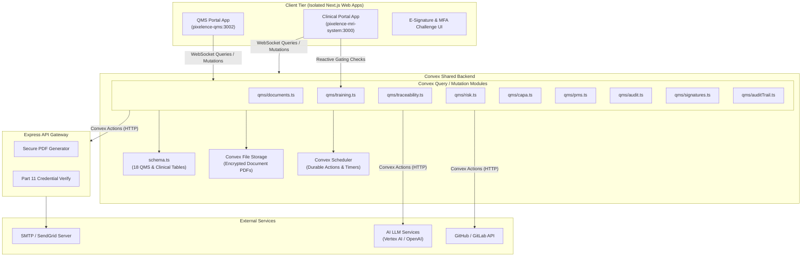
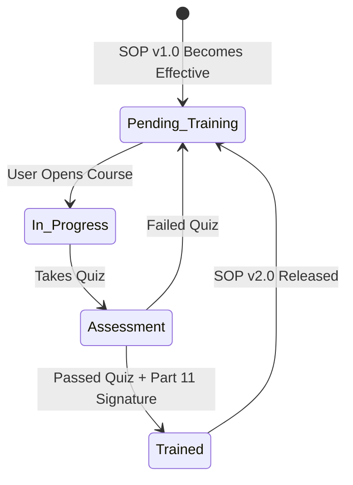
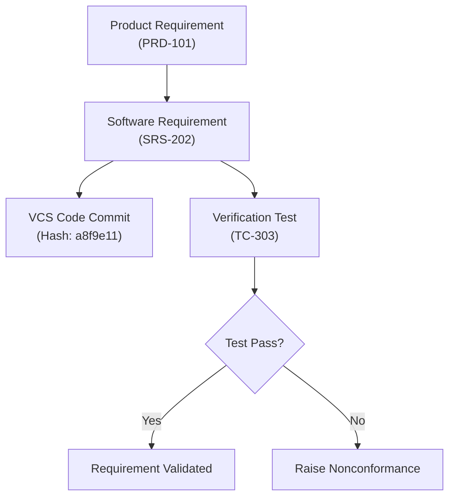

# Pixelence QMS System — Functional Specifications & System Architecture

---

| Field              | Detail                                                       |
|--------------------|--------------------------------------------------------------|
| **Document Title** | QMS Functional Specifications & Compliance Architecture       |
| **System**         | Pixelence Quality Management System (QMS)                     |
| **Version**        | 1.2                                                          |
| **Date**           | July 2, 2026                                                 |
| **Author**         | Antigravity (AI Architect) / Raheel Zubairi                 |
| **Status**         | Draft — Ready for Agentic Development                       |
| **Standards**      | ISO 13485:2016, FDA 21 CFR Part 820/11, ISO 14971:2019, IEC 62304:2006, EU MDR 2017/745 |

---

## Table of Contents

1. [Executive Summary & Regulatory Scope](#1-executive-summary--regulatory-scope)
2. [Convex-Centric System Architecture](#2-convex-centric-system-architecture)
3. [Roles, Permissions & Compliance Matrix](#3-roles-permissions--compliance-matrix)
4. [Module-by-Module Specifications](#4-module-by-module-specifications)
   - 4.1 [Document & Change Control (DCC)](#41-document--change-control-dcc)
   - 4.2 [Training Management (TM)](#42-training-management-tm)
   - 4.3 [Requirements & Traceability (RT)](#43-requirements--traceability-rt)
   - 4.4 [Risk Management (RM) — ISO 14971](#44-risk-management-rm--iso-14971)
   - 4.5 [Design & Development Control (DDC) — Digital DHF](#45-design--development-control-ddc--digital-dhf)
   - 4.6 [CAPA & Nonconformance (CAPA/NC)](#46-capa--nonconformance-capanc)
   - 4.7 [Supplier Quality Management (SQM)](#47-supplier-quality-management-sqm)
   - 4.8 [Complaint Handling & Post-Market Surveillance (PMS)](#48-complaint-handling--post-market-surveillance-pms)
   - 4.9 [Audits & Management Review (AMR)](#49-audits--management-review-amr)
   - 4.10 [AI-Assisted Operations (AI Copilot)](#410-ai-assisted-operations-ai-copilot)
   - 4.11 [Reporting & Analytics](#411-reporting--analytics)
5. [FDA 21 CFR Part 11 & EU Annex 11 Compliance Framework](#5-fda-21-cfr-part-11--eu-annex-11-compliance-framework)
6. [Lightweight Workflows via Convex Scheduler](#6-lightweight-workflows-via-convex-scheduler)
7. [Convex Database Schema (`convex/schema.ts`)](#7-convex-database-schema-convexschemats)
8. [Convex API & Serverless Function Architecture](#8-convex-api--serverless-function-architecture)
9. [Agentic Development Playbook](#9-agentic-development-playbook)

---

## 1. Executive Summary & Regulatory Scope

This document defines the functional and technical specifications for the **Pixelence QMS**, an enterprise-grade Quality Management System tailored for Software as a Medical Device (SaMD). Designed as a reactive QMS module that fully integrates with the Pixelence clinical ecosystem, the platform ensures total regulatory compliance across all phases of the software life cycle.

### 1.1 Regulatory Scope
The system enforces compliance with:
- **ISO 13485:2016**: Quality Management Systems for medical devices.
- **FDA 21 CFR Part 820**: Quality System Regulation (cGMP) for medical devices in the US.
- **ISO 14971:2019**: Application of risk management to medical devices.
- **IEC 62304:2006 / AMD1:2015**: Medical device software — Software lifecycle processes. The Pixelence SaMD is classified as **Class B** (medium risk, where injury is possible but serious injury is prevented by human-in-the-loop review).
- **EU MDR 2017/745**: European Medical Device Regulation.
- **FDA 21 CFR Part 11 / EU Annex 11**: Electronic Records; Electronic Signatures.

---

## 2. Isolated Monorepo System Architecture

To meet strict medical compliance requirements, the QMS is architected as a **separate, isolated Next.js web application** (located in `/pixelence-qms`) running on a distinct port (e.g., Port 3002). This isolates it completely from the main clinical website (`/pixelence-mri-system`, running on Port 3000). 

Both applications run in a unified Turborepo monorepo, sharing the same underlying **Convex serverless backend** at the root of the workspace. This shared database layer enables real-time reactive checks between clinical workflows and QMS compliance states.



### 2.1 Core Architectural Decisions & Isolation Benefits
- **Application & Process Isolation**: Running the QMS as a standalone portal (`pixelence-qms`) ensures that failure modes, dependencies, and bundle sizes are separated. If the clinical system goes down, QMS document retrieval, audits, and training logs remain fully operational.
- **Independent V&V and Deployment**: Changes to the portal UI do not trigger full regression testing (Verification & Validation) of the clinical system under **IEC 62304**, drastically reducing release timelines for minor quality documentation adjustments.
- **Convex BaaS**: Provides fully reactive, real-time client subscriptions to both applications. Gating mutations in `pixelence-mri-system` (like deploying an AI model) can query `pixelence-qms` training tables in real-time with zero latency.
- **Convex Scheduler**: Replaces Temporal.io for workflow automation. It runs background actions (e.g., executing effectiveness evaluations 60 days in the future, sending review reminders) using durable `ctx.scheduler.runAfter` pipelines.
- **Convex File Storage**: Serves as the vault for controlled document PDFs, protected by authorization logic inside Convex queries.
- **Express API Gateway**: Acts as a helper service for operations that require external Node.js libraries, such as compiling templates to PDFs, running OCR on supplier records, or communicating with SMTP mail services.

---

## 3. Roles, Permissions & Compliance Matrix

The QMS module extends permissions using Role-Based Access Control (RBAC) linked to the enterprise Identity Provider (IdP):

| Role | DCC (Docs) | TM (Training) | RT (Trace) | RM (Risk) | DDC (Design) | CAPA/NC | PMS (Complaints) | AMR (Audits) |
|---|:---:|:---:|:---:|:---:|:---:|:---:|:---:|:---:|
| **QMS Manager** (`qms-manager`) | Read/Write | Read/Write | Read/Write | Read/Write | Read/Write | Read/Write | Read/Write | Read/Write |
| **QMS Director** (`qms-director`) | Approve/Rev | Approve | Approve | Approve | Approve | Approve | Read/Write | Approve |
| **Auditor** (`qms-auditor`) | Read Only | Read Only | Read Only | Read Only | Read Only | Read Only | Read Only | Read/Write |
| **Staff Engineer/Doc** (`qms-staff`) | Read Only | Read/Write | Read/Write | Read/Write | Read/Write | Read/Write | Read Only | Read Only |

---

## 4. Module-by-Module Specifications

### 4.1 Document & Change Control (DCC)
**Purpose:** Enforces version control and formal reviews for standard operating procedures (SOPs), manuals, and product requirements.

- **Dual-Control Drafts**: New documents or revisions require an active Change Request (CR) mapping to launch.
- **PDF Rendition**: Upon approval, a Convex action triggers the Express gateway to generate a locked PDF containing a watermarked header (*"CONTROLLED DOCUMENT - ACTIVE"*), version stamp, and the 21 CFR Part 11 signing record block at the end.
- **Version Control Policy**: Minor drafts use decimal releases (v0.1, v0.2). Effective releases increment the major release digit (v1.0, v2.0).

---

### 4.2 Training Management (TM)
**Purpose:** Guarantees and documents that employees are trained on applicable SOPs before performing quality or clinical functions.

- **Training Curriculum**: Groups SOPs required for specific roles (e.g., all radiologists must complete SOP-012: *"AI Enhancement Verification"*).
- **Assessments**: Includes quizzes with custom passing scores (e.g., 80%) built directly into the UI.
- **Gating Mechanism**: The system blocks users from executing critical actions in the clinical portal (such as signing clinical reports or deploying models) if their mandatory training statuses are lapsed or uncompleted.



---

### 4.3 Requirements & Traceability (RT)
**Purpose:** Coordinates product and software specifications, verification testing, and validation protocols to fulfill **IEC 62304** software lifecycle trace audits.

- **Hierarchy**: Product Requirements (PRD) $\rightarrow$ System Requirements (SRS) $\rightarrow$ Software Specifications $\rightarrow$ Source Code Commit/PR $\rightarrow$ Verification Test Cases.
- **Bi-Directional Traceability**: The interface generates a dynamic Traceability Matrix, highlighting any orphans (e.g., a requirement missing a test case, or a design input lacking a source code reference).



---

### 4.4 Risk Management (RM) — ISO 14971
**Purpose:** Evaluates clinical and technical hazards, applies controls, and assesses residual risk.

- **Hazard Register**: Logs potential failures, such as *"AI generates misleading artifacts"* or *"API Gateway exposes patient record"*.
- **Quantitative Scoring (FMEA)**: Requires evaluation of Severity (S, 1-5), Probability (P, 1-5), and Detectability (D, 1-5).
- **Traceability Link**: Mitigations must map to a specific Software Requirement (SRS) and Verification Test Case to prove implementation.
- **Residual Risk Assessment**: Once verification tests pass, the system computes the post-mitigation RPN to confirm it falls below target thresholds.

---

### 4.5 Design & Development Control (DDC) — Digital DHF
**Purpose:** Assembles and freezes design artifacts during the product development lifecycle.

- **Design History File (DHF) Phases**:
  1. *Planning*: Scope, timelines, validation protocols.
  2. *Inputs*: Clinical, regulatory, and technical requirements.
  3. *Outputs*: Model architecture configs, database schema, code releases.
  4. *Verification & Validation (V&V)*: Execution reports for automated test suites, clinical trial records.
  5. *Design Transfer*: Deployment packages, environment variables, release sign-offs.
- **Design Review Sign-offs**: Formal, multi-user approval reviews locked with electronic signatures before launching or transitioning phases.

---

### 4.6 CAPA & Nonconformance (CAPA/NC)
**Purpose:** Resolves system deviations, product nonconformances, and audit failures.

- **Nonconformance (NC) Handling**: Captures immediate system errors (such as failed test suites or API gateway outages). The QA team applies immediate containment (e.g., rolling back a release).
- **CAPA Escalation**: Serious or recurring NCs escalate to a formal CAPA record.
- **Root Cause Analysis (RCA)**: The interface structures investigations using the *5 Whys* methodology or *Ishikawa (Fishbone) Diagrams*.
- **Effectiveness Check**: Once actions execute, the CAPA enters a mandatory verification period (e.g., 60 days). Convex Scheduler triggers a query at the end of the period, requiring the QMS Manager to verify that the root cause was successfully mitigated before closing the record.

---

### 4.7 Supplier Quality Management (SQM)
**Purpose:** Qualifies, rates, and monitors suppliers providing critical dependencies (e.g., GPU hardware, hosting, clinical validation panels).

- **Supplier Registry**: Classifies vendors by criticality level (Critical, Major, Minor).
- **Approved Supplier List (ASL)**: Active list showing validation states and certificate details.
- **Supplier Corrective Action Request (SCAR)**: Triggers a formal quality action loop directly to a vendor contact, requiring them to upload root cause details and containment evidence.

---

### 4.8 Complaint Handling & Post-Market Surveillance (PMS)
**Purpose:** Monitors active product performance, handles feedback, and routes adverse events.

- **Portal Loop**: Standard clinical users can flag a clinical report via the *"Report Inaccuracy"* button. This action automatically routes the report payload to the QMS PMS module as an unreviewed complaint.
- **MDR and Vigilance Decision Tree**: Tracks and prompts QA teams on whether to submit an FDA Medical Device Report (MDR) or EU MDR Vigilance Notification (within 15 days for serious incidents, or 30 days for malfunctions).

---

### 4.9 Audits & Management Review (AMR)
**Purpose:** Manages internal or supplier audits and records executive reviews of the quality system.

- **Audit Schedules**: Schedules audit targets, links checklists, and logs auditors.
- **Findings Registry**: Logs major NCs, minor NCs, and opportunities for improvement (OFI), automatically linking major findings to new CAPA flows.
- **Management Reviews**: Logs agendas (such as complaint trends, CAPA backlogs, and resource needs), records meeting minutes, and issues mandatory follow-up action items.

---

### 4.10 AI-Assisted Operations (AI Copilot)
**Purpose:** Uses generative AI models to speed up manual quality processes and reduce compliance overhead.

- **SOP Draft Generator**: Generates formatted, structured SOP drafts based on regulatory templates and target activities.
- **Risk Assessment Helper**: Scans software requirement descriptions to suggest potential FMEA hazards, severity ratings, and mitigation actions based on historical cases.
- **Traceability Auditor**: Analyzes trace matrices to identify gaps, such as test cases that do not map to any requirements, or risks missing validation tests.

---

### 4.11 Reporting & Analytics
**Purpose:** Provides real-time metrics on QMS performance and audit readiness for executive review.

- **CAPA Dashboard**: Tracks CAPA age trends, overdue tasks, and root-cause distributions.
- **Document Matrix**: Identifies documents nearing their mandatory periodic review date.
- **Executive Review Dashboard**: Aggregates KPIs like training compliance rates, audit schedules, and open complaints.

---

## 5. FDA 21 CFR Part 11 & EU Annex 11 Compliance Framework

To guarantee the validity of electronic quality records, the Convex backend must enforce strict data verification rules.

### 5.1 Dual-Factor E-Signatures
Every electronic signature requires two parameters:
1. **Primary Authentication**: Username / Email verified via Convex Auth session context.
2. **Secondary Challenge**: Direct re-authentication password entry verified via a secure Convex action calling standard password-comparison logic (`bcryptjs`).
3. **Execution Metadata**: The record must display the user's printed name, the date and time of signing, and the meaning of the signature (e.g., *"Author"*, *"Reviewer"*, *"Approval"*).

### 5.2 Immutable Audit Trail
- **System-Level Log**: Every insert, update, or soft-delete targeting QMS tables writes an audit log entry.
- **Implementation**: Convex mutations require validation wraps. A helper utility runs inside critical mutations to record changes:
  ```typescript
  // Helper to record audit logs inside mutations
  export async function writeAuditLog(
    db: any,
    userId: string,
    action: string,
    tableName: string,
    recordId: string,
    previousState: any,
    newState: any,
    ipAddress: string
  ) {
    await db.insert("qms_audit_logs", {
      userId,
      action,
      tableName,
      recordId,
      previousState: previousState ? JSON.stringify(previousState) : undefined,
      newState: newState ? JSON.stringify(newState) : undefined,
      ipAddress,
      timestamp: new Date().toISOString(),
    });
  }
  ```
- **Immutability**: There are no Convex mutations exposed that perform updates or deletes targeting the `qms_audit_logs` table, keeping it strictly append-only.

---

## 6. Lightweight Workflows via Convex Scheduler

Convex scheduled functions manage workflows safely over long periods, removing the need for external systems like Temporal.io.

### 6.1 Document Review & Approval Workflow
```typescript
import { mutation, action, internalMutation } from "./_generated/server";
import { api } from "./_generated/api";

// 1. Mutation: Starts Document Review
export const initiateDocumentReview = mutation({
  handler: async (ctx, args) => {
    const doc = await ctx.db.get(args.docId);
    
    // Transition status
    await ctx.db.patch(args.docId, { status: "in-review" });
    
    // Schedule a reminder task for 7 days in the future
    await ctx.scheduler.runAfter(7 * 24 * 60 * 60 * 1000, api.qms.documents.reviewReminderAction, {
      docId: args.docId,
      reviewers: args.reviewers
    });
  }
});
```

### 6.2 CAPA Effectiveness Verification Workflow
1. When all action items of a CAPA resolve, a mutation updates the status to `verification`.
2. The mutation schedules a verification review task (e.g., 60 days later):
   ```typescript
   await ctx.scheduler.runAfter(60 * 24 * 60 * 60 * 1000, api.qms.capa.triggerVerificationEvaluation, {
     capaId: capaId
   });
   ```
3. The scheduled action evaluates current metrics and alerts the QA lead to sign off on the effectiveness review.

---

## 7. Convex Database Schema (`convex/schema.ts`)

The Convex schema defines the database models, using strict indexes to support trace matrix operations and audits:

```typescript
import { defineSchema, defineTable } from "convex/server";
import { v } from "convex/values";

export default defineSchema({
  users: defineTable({
    email: v.string(),
    passwordHash: v.string(),
    firstName: v.string(),
    lastName: v.string(),
    role: v.union(
      v.literal("super-admin"),
      v.literal("qms-manager"),
      v.literal("qms-director"),
      v.literal("qms-auditor"),
      v.literal("staff")
    ),
    isActive: v.boolean(),
    createdAt: v.string(),
    updatedAt: v.string(),
  }).index("by_email", ["email"]),

  qms_documents: defineTable({
    title: v.string(),
    docNumber: v.string(), // SOP-001, PRD-002
    version: v.string(), // e.g. "1.0"
    type: v.union(
      v.literal("sop"),
      v.literal("manual"),
      v.literal("specification"),
      v.literal("policy"),
      v.literal("protocol")
    ),
    status: v.union(
      v.literal("draft"),
      v.literal("in-review"),
      v.literal("awaiting-approval"),
      v.literal("effective"),
      v.literal("archived"),
      v.literal("obsolete")
    ),
    contentUrl: v.string(),
    fileStorageId: v.optional(v.string()), // Reference to Convex file storage
    createdById: v.id("users"),
    changeRequestId: v.optional(v.id("qms_change_requests")),
    createdAt: v.string(),
    updatedAt: v.string(),
  }).index("by_docNumber", ["docNumber"]),

  qms_change_requests: defineTable({
    crNumber: v.string(), // CR-2026-001
    title: v.string(),
    description: v.string(),
    impactAssessment: v.string(),
    status: v.union(
      v.literal("open"),
      v.literal("approved"),
      v.literal("executed"),
      v.literal("rejected")
    ),
    createdAt: v.string(),
    updatedAt: v.string(),
  }).index("by_crNumber", ["crNumber"]),

  qms_training_programs: defineTable({
    title: v.string(),
    description: v.string(),
    passingScore: v.number(), // default: 80
    documentId: v.id("qms_documents"),
    createdAt: v.string(),
    updatedAt: v.string(),
  }),

  qms_training_records: defineTable({
    userId: v.id("users"),
    programId: v.id("qms_training_programs"),
    quizScore: v.number(),
    isPassed: v.boolean(),
    completedAt: v.optional(v.string()),
    status: v.union(
      v.literal("pending"),
      v.literal("in-progress"),
      v.literal("completed")
    ),
    createdAt: v.string(),
  }).index("by_user_program", ["userId", "programId"]),

  qms_requirements: defineTable({
    reqNumber: v.string(), // REQ-SRS-001
    title: v.string(),
    description: v.string(),
    source: v.string(), // PRD, Standards, etc.
    verificationRef: v.optional(v.string()), // ID of related test case
    createdAt: v.string(),
    updatedAt: v.string(),
  }).index("by_reqNumber", ["reqNumber"]),

  qms_requirement_traces: defineTable({
    sourceId: v.id("qms_requirements"),
    targetId: v.id("qms_requirements"),
    createdAt: v.string(),
  }).index("by_source", ["sourceId"]).index("by_target", ["targetId"]),

  qms_risks: defineTable({
    riskNumber: v.string(), // RISK-001
    hazard: v.string(),
    consequence: v.string(),
    preSeverity: v.number(),
    preProbability: v.number(),
    preDetectability: v.number(),
    preRpn: v.number(),
    mitigation: v.string(),
    postSeverity: v.number(),
    postProbability: v.number(),
    postDetectability: v.number(),
    postRpn: v.number(),
    status: v.string(), // OPEN, MITIGATED, ACCEPTABLE
    createdAt: v.string(),
    updatedAt: v.string(),
  }).index("by_riskNumber", ["riskNumber"]),

  qms_dhf_projects: defineTable({
    projectName: v.string(),
    status: v.union(
      v.literal("planning"),
      v.literal("active"),
      v.literal("validation"),
      v.literal("transferred"),
      v.literal("completed")
    ),
    createdAt: v.string(),
  }),

  qms_dhf_items: defineTable({
    projectId: v.id("qms_dhf_projects"),
    itemType: v.union(
      v.literal("input"),
      v.literal("output"),
      v.literal("verification"),
      v.literal("validation")
    ),
    itemCode: v.string(), // DI-001, DO-003, V-002
    description: v.string(),
    status: v.union(
      v.literal("draft"),
      v.literal("verified"),
      v.literal("approved")
    ),
    linkedItems: v.array(v.string()), // References to linked DHF Item Codes
    approvedBy: v.optional(v.id("users")),
    createdAt: v.string(),
  }).index("by_project_code", ["projectId", "itemCode"]),

  qms_capas: defineTable({
    capaNumber: v.string(), // CAPA-2026-001
    source: v.string(),
    description: v.string(),
    containmentAction: v.string(),
    rootCauseMethod: v.string(), // 5 Whys, Ishikawa
    rootCauseAnalysis: v.string(),
    effectivenessPlan: v.string(),
    verificationDate: v.string(),
    isEffective: v.optional(v.boolean()),
    status: v.union(
      v.literal("initiated"),
      v.literal("investigating"),
      v.literal("actions-active"),
      v.literal("verification"),
      v.literal("closed")
    ),
    closedById: v.optional(v.id("users")),
    closedAt: v.optional(v.string()),
    createdAt: v.string(),
    updatedAt: v.string(),
  }).index("by_capaNumber", ["capaNumber"]),

  qms_capa_action_items: defineTable({
    capaId: v.id("qms_capas"),
    task: v.string(),
    assignedToId: v.id("users"),
    dueDate: v.string(),
    status: v.union(v.literal("pending"), v.literal("completed")),
    completedAt: v.optional(v.string()),
  }).index("by_capa", ["capaId"]),

  qms_suppliers: defineTable({
    name: v.string(),
    criticality: v.union(v.literal("critical"), v.literal("major"), v.literal("minor")),
    serviceProvided: v.string(),
    certificationUrl: v.optional(v.string()),
    certificationExpiry: v.optional(v.string()),
    evaluationScore: v.number(), // default: 100
    status: v.union(v.literal("approved"), v.literal("conditional"), v.literal("suspended")),
    lastAuditDate: v.optional(v.string()),
    createdAt: v.string(),
    updatedAt: v.string(),
  }),

  qms_complaints: defineTable({
    complaintNumber: v.string(), // CMP-2026-001
    customerName: v.string(),
    customerEmail: v.string(),
    description: v.string(),
    adverseEvent: v.boolean(),
    seriousInjury: v.boolean(),
    mdrReportable: v.boolean(),
    status: v.union(
      v.literal("received"),
      v.literal("investigating"),
      v.literal("capa-raised"),
      v.literal("resolved")
    ),
    resolution: v.optional(v.string()),
    resolvedAt: v.optional(v.string()),
    createdAt: v.string(),
    updatedAt: v.string(),
  }).index("by_complaintNumber", ["complaintNumber"]),

  qms_audits: defineTable({
    auditNumber: v.string(), // AUD-2026-001
    type: v.union(v.literal("internal"), v.literal("external"), v.literal("supplier")),
    scope: v.string(),
    leadAuditor: v.string(),
    targetDate: v.string(),
    status: v.union(v.literal("scheduled"), v.literal("in-progress"), v.literal("completed")),
    minutesUrl: v.optional(v.string()),
    createdAt: v.string(),
    updatedAt: v.string(),
  }).index("by_auditNumber", ["auditNumber"]),

  qms_audit_findings: defineTable({
    auditId: v.id("qms_audits"),
    severity: v.union(v.literal("major-nc"), v.literal("minor-nc"), v.literal("ofi")),
    description: v.string(),
    createdAt: v.string(),
  }).index("by_audit", ["auditId"]),

  qms_electronic_signatures: defineTable({
    userId: v.id("users"),
    signedAt: v.string(),
    meaning: v.string(),
    signatureHash: v.string(),
    // Targets
    documentId: v.optional(v.id("qms_documents")),
    changeRequestId: v.optional(v.id("qms_change_requests")),
    capaId: v.optional(v.id("qms_capas")),
    trainingRecordId: v.optional(v.id("qms_training_records")),
  }),

  qms_audit_logs: defineTable({
    userId: v.id("users"),
    action: v.string(), // "CREATE", "UPDATE", "DELETE", "VIEW"
    tableName: v.string(),
    recordId: v.string(),
    previousState: v.optional(v.string()), // JSON string
    newState: v.optional(v.string()), // JSON string
    ipAddress: v.string(),
    timestamp: v.string(),
  }).index("by_timestamp", ["timestamp"]),
});
```

---

## 8. Convex API & Serverless Function Architecture

All data operations utilize file-based serverless actions, queries, and mutations structured inside `/convex/qms/`.

### 8.1 API Definitions

- **`convex/qms/documents.ts`**:
  - `query list(ctx, { type })`: Returns documents based on selection.
  - `mutation createDraft(ctx, { title, number, type, changeRequestId })`: Starts a draft document.
  - `action requestApproval(ctx, { docId, reviewers, approver })`: Runs background workflows, notifying reviewing parties via HTTP post calls to the Express email gateway.
  - `mutation applySignatureAndPublish(ctx, { docId, signHash, meaning })`: Verifies signatures and updates documents to `effective`.
- **`convex/qms/training.ts`**:
  - `query getCurriculumForUser(ctx, { userId })`: Evaluates active training courses.
  - `mutation completeAssessment(ctx, { recordId, quizScore, passed })`: Submits results.
- **`convex/qms/traceability.ts`**:
  - `query checkTraceMatrix(ctx)`: Returns current requirement coverage trace trees.
- **`convex/qms/ai.ts`** *(Convex Actions targeting external APIs)*:
  - `action generateSopDraft(ctx, { promptText })`: Requests formatted SOP drafts from LLM nodes.
  - `action suggestHazards(ctx, { requirementText })`: Translates SRS text to hazard records.

---

## 9. Agentic Development Playbook

For future coding agents implementing this Convex QMS schema:

### Phase 1: Workspace & Database Setup
1. Initialize a new folder `/pixelence-qms` at the root of the workspace. Create a standalone Next.js boilerplate (`npx create-next-app@latest .` with TypeScript and Tailwind CSS).
2. Register `"pixelence-qms"` inside the root `package.json` `workspaces` array.
3. Copy the schema definitions in Section 7 and merge them into the shared `/convex/schema.ts` file at the workspace root.
4. Run `npx convex dev` from the workspace root to register migrations and initialize the shared tables.
5. Create `convex/qms/auditTrail.ts` and define the `writeAuditLog` helper. Wrap all write mutations in QMS file modules with a call to this helper.

### Phase 2: Dual-Factor Signature Engine
1. Add an endpoint in the Express API Gateway (`/api/qms/esign/verify`) that accepts credentials, compares password hashes with `bcryptjs`, and returns an HMAC-SHA256 signature hash.
2. Write the Convex Action `signatures.verifyAndApply` to accept e-signature payloads, confirm authenticity, write records to `qms_electronic_signatures`, and advance document/CAPA workflows.

### Phase 3: Workflows & Scheduling
1. Code the scheduled functions inside `convex/qms/scheduler.ts` for reminder intervals, document reviews, and CAPA verification timers.
2. Import training checks into the main clinical app (`pixelence-mri-system`) to block critical actions if the corresponding user's `qms_training_records` status is not complete.

### Phase 4: Isolated Web Portal Building
1. Build out the frontend pages inside `/pixelence-qms/pages/` (such as `documents/`, `training/`, `risk/`, and `capa/`).
2. Construct QMS-specific React views (like the Traceability Matrix graph, automated FMEA calculators, and credentials-enforcing `ESignatureModal` overlay).
