# Pixelence MRI System — System Functional Documentation

---

| Field              | Detail                                         |
|--------------------|------------------------------------------------|
| **Document Title** | System Functional Documentation & Architecture |
| **System**         | Pixelence MRI Web Application                  |
| **Version**        | 1.0 (Applify-Branch)                           |
| **Date**           | 18 March 2026                                  |
| **Author**         | Raheel Zubairi                                 |
| **Status**         | Draft — Internal Review                        |

---

## Table of Contents

1. [System Overview](#1-system-overview)
2. [High-Level Architecture](#2-high-level-architecture)
3. [Technology Stack](#3-technology-stack)
4. [System Components](#4-system-components)
   - 4.1 [Next.js Web Application](#41-nextjs-web-application)
   - 4.2 [Convex Backend (BaaS)](#42-convex-backend-baas)
   - 4.3 [Express API Gateway](#43-express-api-gateway)
   - 4.4 [FastAPI ML Service](#44-fastapi-ml-service)
   - 4.5 [Mobile Application](#45-mobile-application)
5. [Data Model (Entity-Relationship)](#5-data-model-entity-relationship)
6. [Roles & Permission Matrix](#6-roles--permission-matrix)
7. [Authentication & Session Architecture](#7-authentication--session-architecture)
8. [Core Clinical Workflow](#8-core-clinical-workflow)
9. [Notification System](#9-notification-system)
10. [License & Multi-Hospital Architecture](#10-license--multi-hospital-architecture)
11. [Frontend Route Map](#11-frontend-route-map)
12. [Convex API Reference](#12-convex-api-reference)
13. [Express Gateway API Reference](#13-express-gateway-api-reference)
14. [Environment Configuration](#14-environment-configuration)
15. [Deployment Architecture](#15-deployment-architecture)

---

## 1. System Overview

Pixelence MRI System is a **multi-tenant, role-based clinical imaging management platform** for hospital MRI workflows. It connects radiographers, radiologists, and doctors in an end-to-end digital chain from patient appointment booking through DICOM image upload, AI-assisted MRI enhancement, radiologist reporting, and final doctor consultation.

### 1.1 Core Purpose

| Domain                | Capability                                                       |
|-----------------------|------------------------------------------------------------------|
| **Clinical Workflow** | Appointment → DICOM upload → AI Analysis → Report → Consultation |
| **Multi-Hospital**    | Isolated data per hospital; super-admin manages all tenants      |
| **Licensing**         | Per-scan or monthly-fixed billing; license gates staff access    |
| **Notifications**     | Real-time in-app (Convex) + email (SMTP) at each workflow stage  |
| **AI Enhancement**    | FastAPI ML service generates enhanced MRI images for radiologists|
| **Mobile Access**     | React Native mobile app for doctors to view reports & comments   |

### 1.2 Key Design Principles

- **Real-time first** — Convex reactive queries push data changes to all connected clients instantly with no polling
- **Role-isolated views** — Each role sees only the pages, data, and actions relevant to their function
- **Hospital-scoped data** — All clinical records are tagged with `hospitalId`; queries are always filtered by hospital
- **License-gated access** — Hospital staff cannot log in unless their hospital's license is active and not expired
- **Dual notifications** — Critical workflow events trigger both in-app (Convex) and email (SMTP via Express gateway) notifications simultaneously

---

## 2. High-Level Architecture

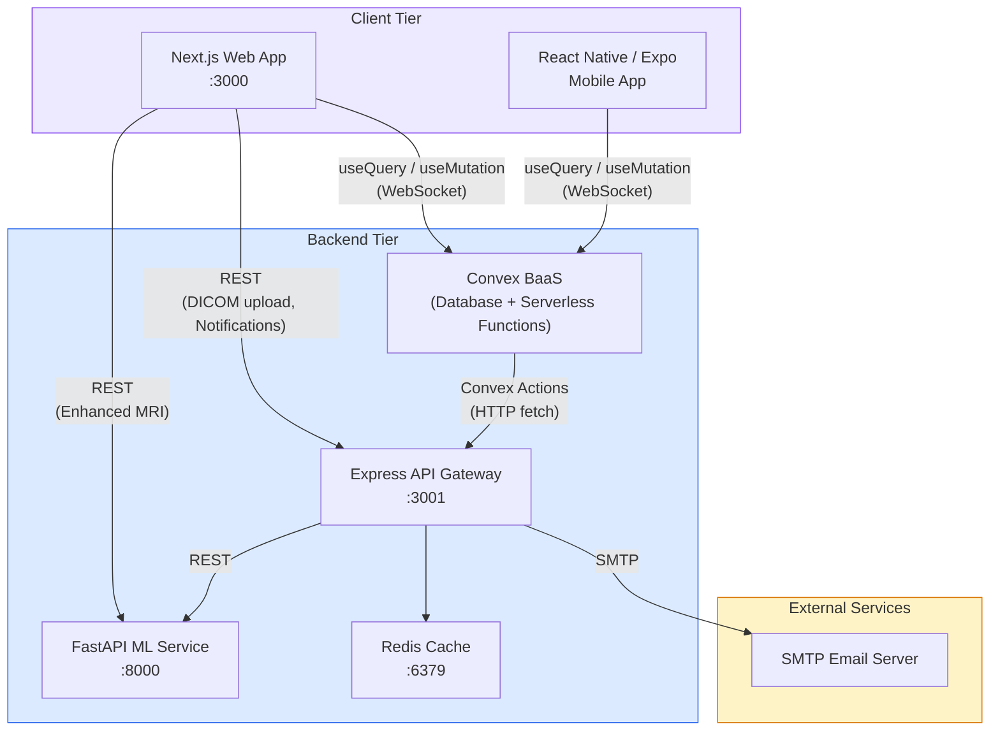

### 2.1 Data Flow Overview

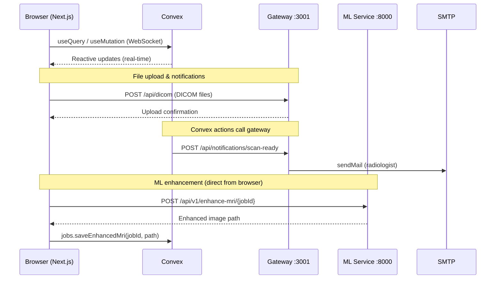

---

## 3. Technology Stack

| Layer              | Technology                     | Version   | Role                                            |
|--------------------|--------------------------------|-----------|-------------------------------------------------|
| **Web Framework**  | Next.js                        | 14.x      | SSR/CSR React framework, page routing           |
| **UI Library**     | React                          | 18.x      | Component model                                 |
| **Styling**        | Tailwind CSS                   | 3.x       | Utility-first CSS                               |
| **Backend-as-a-Service** | Convex                   | Latest    | Reactive database, serverless functions, auth   |
| **Convex Client**  | `convex/react`                 | Latest    | `useQuery`, `useMutation`, `useAction` hooks    |
| **API Gateway**    | Express.js                     | 4.x       | File uploads, email dispatch, ML proxy          |
| **ML Service**     | FastAPI (Python)               | Latest    | MRI image enhancement pipeline                  |
| **Mobile**         | Expo / React Native            | SDK 55    | Cross-platform iOS/Android app                  |
| **Caching**        | Redis                          | 7.x       | Session/rate-limit cache on gateway             |
| **Email**          | Nodemailer                     | 6.x       | SMTP email dispatch                             |
| **Auth Hashing**   | bcryptjs                       | 2.x       | Password hashing (salt rounds: 10)              |
| **Security**       | Helmet, express-rate-limit     | Latest    | HTTP security headers, DDoS rate limiting       |
| **File Upload**    | express-fileupload             | Latest    | DICOM file upload (max 100 MB)                  |
| **Logging**        | Winston                        | 3.x       | Structured JSON logging on gateway              |
| **Monorepo**       | Turborepo                      | Latest    | Monorepo task orchestration                     |

---

## 4. System Components

### 4.1 Next.js Web Application

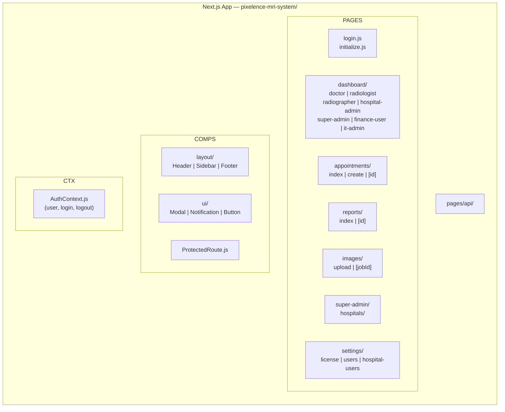

**Key conventions:**
- All pages are wrapped in `ProtectedRoute` specifying `allowedRoles`
- `AuthContext` provides `user`, `isAuthenticated`, `login()`, `logout()` to the entire tree
- `Sidebar` renders role-filtered navigation links based on `user.role`
- Convex hooks (`useQuery`, `useMutation`, `useAction`) are used directly in pages — no separate API layer on the frontend

### 4.2 Convex Backend (BaaS)

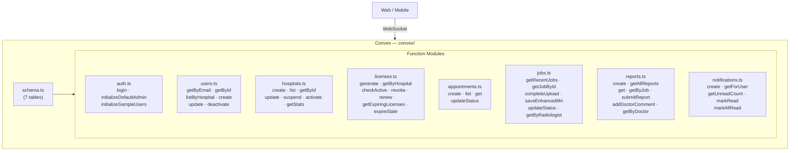

**Function types used:**
| Type | Purpose | Network |
|------|---------|---------|
| `query` | Read-only reactive subscriptions | WebSocket (push) |
| `mutation` | Transactional writes to the database | WebSocket |
| `action` | Side effects — can call external HTTP, use bcrypt | HTTP |

### 4.3 Express API Gateway

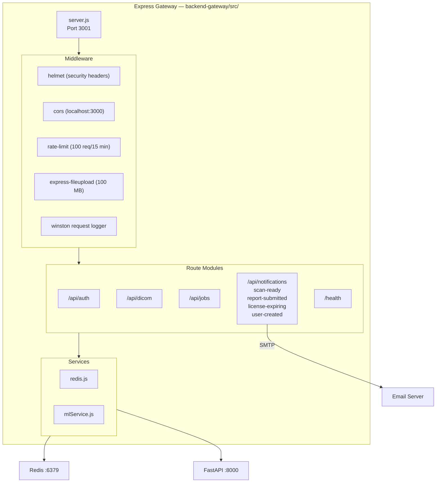

### 4.4 FastAPI ML Service

The ML service is an external Python FastAPI application responsible for AI-based MRI image enhancement. The web application interacts with it directly from the browser on the report detail page.

| Endpoint | Method | Called By | Purpose |
|----------|--------|-----------|---------|
| `/api/v1/enhance-mri/{jobId}` | `POST` | Browser (report detail page) | Generate enhanced MRI for a job |
| `/api/v1/enhance-mri/{jobId}` | `GET` | Browser | Retrieve existing enhanced MRI image |

After enhancement, the browser calls `jobs.saveEnhancedMri(jobId, enhancedMriPath)` to persist the result path in Convex.

### 4.5 Mobile Application

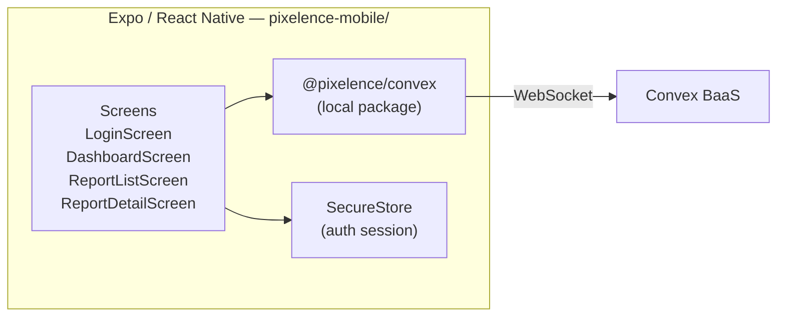

The mobile app uses the same Convex backend, connecting via `@pixelence/convex` (a local workspace package wrapping `convex-client`). Authentication tokens are stored in Expo SecureStore rather than localStorage. The primary mobile use case is **doctors reviewing reports and adding comments** via `ReportDetailScreen`.

---

## 5. Data Model (Entity-Relationship)

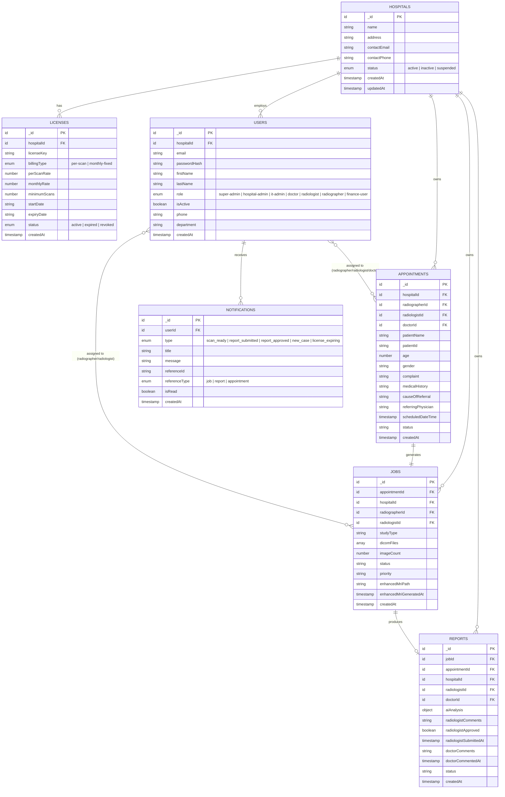

### 5.1 AI Analysis Sub-Object

The `reports.aiAnalysis` field stores structured AI output:

```
aiAnalysis {
  sitesOfUptake          : string   — Anatomical locations with abnormal uptake
  natureOfUptake         : string   — Description of uptake characteristics
  conclusion             : string   — AI-generated clinical conclusion
  diagnosisRecommendations: string  — Recommended next clinical steps
}
```

### 5.2 Status Lifecycle

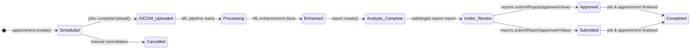

---

## 6. Roles & Permission Matrix

### 6.1 Role Definitions

| Role | Code | Scope | Primary Function |
|------|------|-------|-----------------|
| Super Admin | `super-admin` | System-wide (no hospitalId) | Manage all hospitals, licenses, system health |
| Hospital Admin | `hospital-admin` | Single hospital | Manage staff, monitor cases, view reports |
| IT Admin | `it-admin` | Single hospital | System config, user management |
| Doctor | `doctor` | Single hospital | Receive referrals, read reports, add clinical comments |
| Radiologist | `radiologist` | Single hospital | Review DICOM, generate enhanced MRI, submit reports |
| Radiographer | `radiographer` | Single hospital | Upload DICOM files for scheduled appointments |
| Finance User | `finance-user` | Single hospital | Billing, invoice management, revenue tracking |

### 6.2 Page Access Matrix

| Route | super-admin | hospital-admin | it-admin | doctor | radiologist | radiographer | finance-user |
|-------|:-----------:|:--------------:|:--------:|:------:|:-----------:|:------------:|:------------:|
| `/dashboard/super-admin` | ✅ | — | — | — | — | — | — |
| `/dashboard/hospital-admin` | — | ✅ | — | — | — | — | — |
| `/dashboard/it-admin` | — | — | ✅ | — | — | — | — |
| `/dashboard/doctor` | — | — | — | ✅ | — | — | — |
| `/dashboard/radiologist` | — | — | — | — | ✅ | — | — |
| `/dashboard/radiographer` | — | — | — | — | — | ✅ | — |
| `/dashboard/finance-user` | — | — | — | — | — | — | ✅ |
| `/appointments` | ✅ | ✅ | — | — | — | ✅ | — |
| `/appointments/create` | ✅ | ✅ | — | — | — | — | — |
| `/images/upload` | — | — | — | — | — | ✅ | — |
| `/reports` | ✅ | ✅ | — | ✅ | ✅ | — | — |
| `/reports/[id]` | ✅ | ✅ | — | ✅ | ✅ | — | — |
| `/super-admin/hospitals` | ✅ | — | — | — | — | — | — |
| `/settings/license` | — | ✅ | — | — | — | — | — |
| `/settings/hospital-users` | — | ✅ | ✅ | — | — | — | — |
| `/billing` | — | — | — | — | — | — | ✅ |

### 6.3 Report Detail Feature Access

| Feature | super-admin | hospital-admin | doctor | radiologist | radiographer |
|---------|:-----------:|:--------------:|:------:|:-----------:|:------------:|
| View patient info | ✅ | ✅ | ✅ | ✅ | — |
| View AI analysis | ✅ | ✅ | ✅ | ✅ | — |
| Generate Enhanced MRI | — | — | — | ✅ | — |
| Add radiologist comments | — | — | — | ✅ | — |
| Approve & submit report | — | — | — | ✅ | — |
| View radiologist comments (read-only) | ✅ | ✅ | ✅ | — | — |
| Add doctor comments | — | — | ✅ | — | — |
| View doctor comments (read-only) | ✅ | ✅ | — | — | — |

---

## 7. Authentication & Session Architecture

### 7.1 Login Flow

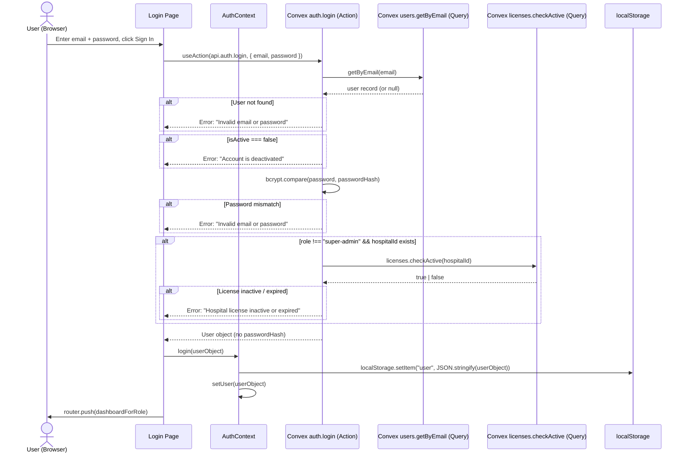

### 7.2 Session & Route Guard

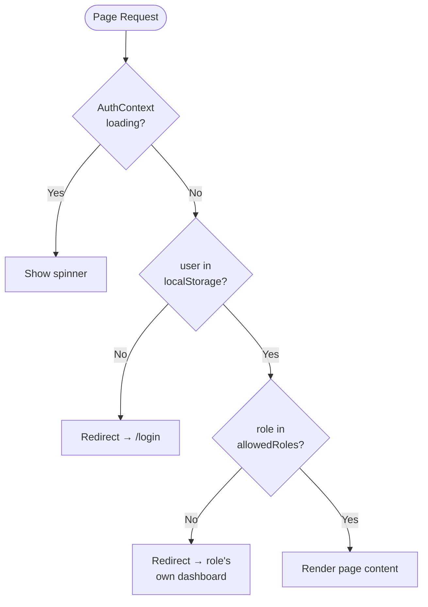

### 7.3 Session Storage Model

Session state lives entirely in the browser. No server-side session tokens are issued.

```
localStorage["user"] = {
  _id: "convex-document-id",
  email: "user@hospital.com",
  firstName: "Jane",
  lastName: "Doe",
  role: "radiologist",
  hospitalId: "hospital-convex-id",
  phone: "+60...",
  department: "Radiology"
}
```

**AuthContext API:**

| Member | Type | Description |
|--------|------|-------------|
| `user` | `object \| null` | Current user or null |
| `isAuthenticated` | `boolean` | `user !== null` |
| `loading` | `boolean` | True during initial localStorage read |
| `login(userData)` | `function` | Persists user to localStorage, sets context |
| `logout()` | `function` | Clears localStorage, resets context, redirects to `/login` |

---

## 8. Core Clinical Workflow

### 8.1 End-to-End Workflow

```mermaid
flowchart TD
    START([Patient Arrives]) --> A

    A["Hospital Admin / Doctor<br/>Creates Appointment<br/>/appointments → modal form"]
    A --> B["Convex: appointments.create()<br/>Auto-creates Job with status = Scheduled"]

    B --> C["Radiographer Dashboard<br/>Sees alert: Scan awaiting upload"]
    C --> D["Radiographer uploads DICOM<br/>/images/upload?jobId=..."]
    D --> E["Convex: jobs.completeUpload()<br/>Job → DICOM Uploaded<br/>Appointment → DICOM Uploaded"]

    E --> F1["In-app notification\ncreated for Radiologist"]
    E --> F2["POST /api/notifications/scan-ready\n→ Email to Radiologist"]

    F1 --> G["Radiologist logs in\nSees notification bell increment"]
    F2 --> G

    G --> H["Radiologist opens report\n/reports/[id]"]
    H --> I["Radiologist clicks Generate Enhanced MRI<br/>POST /api/v1/enhance-mri/{jobId}"]
    I --> J["FastAPI ML Service processes DICOM<br/>Returns enhanced image path"]
    J --> K["Convex: jobs.saveEnhancedMri()<br/>Enhanced image displayed"]

    K --> L["Radiologist reviews AI Analysis,\nenhanced image, adds comments"]
    L --> M{Approve?}

    M -- "Approve & Submit" --> N["Convex: reports.submitReport(approved=true)<br/>Report → Approved<br/>Job → Completed<br/>Appointment → Completed"]
    M -- "Submit with Edits" --> N2["Convex: reports.submitReport(approved=false)<br/>Report → Submitted"]

    N --> O1["In-app notification\ncreated for Doctor + Hospital Admin"]
    N --> O2["POST /api/notifications/report-submitted\n→ Email to Doctor + Hospital Admin"]
    N2 --> O1
    N2 --> O2

    O1 --> P["Doctor logs in\nSees notification bell increment"]
    O2 --> P

    P --> Q["Doctor opens report\n/reports/[id]"]
    Q --> R["Doctor reads radiologist comments\nand AI analysis"]
    R --> S["Doctor adds clinical comments\n'Save Comments' button"]
    S --> T["Convex: reports.addDoctorComment()<br/>doctorComments saved<br/>doctorCommentedAt timestamp set"]

    T --> U["Comments visible in\nmobile app ReportDetailScreen"]
    U --> END([Workflow Complete])

    style START fill:#7c3aed,color:#fff
    style END fill:#059669,color:#fff
    style N fill:#dbeafe
    style N2 fill:#fef3c7
```

### 8.2 Appointment & Job Status Transitions

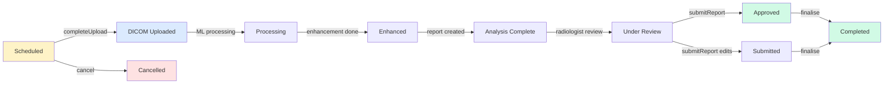

---

## 9. Notification System

### 9.1 Dual-Channel Architecture

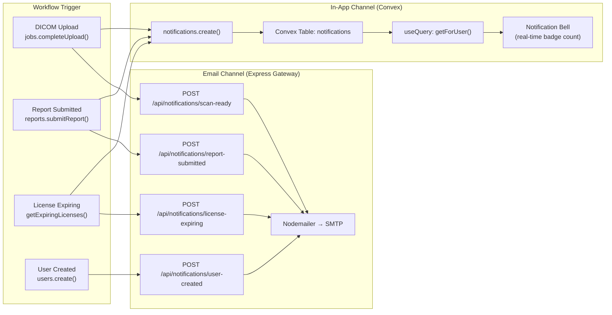

### 9.2 Notification Types

| Type | Trigger | Recipients | In-App | Email |
|------|---------|------------|:------:|:-----:|
| `scan_ready` | `jobs.completeUpload()` | Assigned radiologist | ✅ | ✅ |
| `report_submitted` | `reports.submitReport()` | Doctor + hospital-admins | ✅ | ✅ |
| `report_approved` | `reports.submitReport(approved=true)` | Doctor | ✅ | — |
| `license_expiring` | Scheduled check (≤30 days) | super-admin + hospital-admin | ✅ | ✅ |
| `new_case` | `appointments.create()` | Radiographer | ✅ | — |
| *(user created)* | `users.create()` | New staff member | — | ✅ |

### 9.3 In-App Notification Schema

```
notifications {
  userId        : id(users)         — recipient
  type          : enum              — scan_ready | report_submitted | ...
  title         : string            — short display title
  message       : string            — full notification body
  referenceId   : string?           — linked document id (job/report/appointment)
  referenceType : "job"|"report"|"appointment"
  isRead        : boolean
  createdAt     : timestamp
}

Indexes:
  by_user           [userId]
  by_user_unread    [userId, isRead]
```

### 9.4 Notification Read Flow

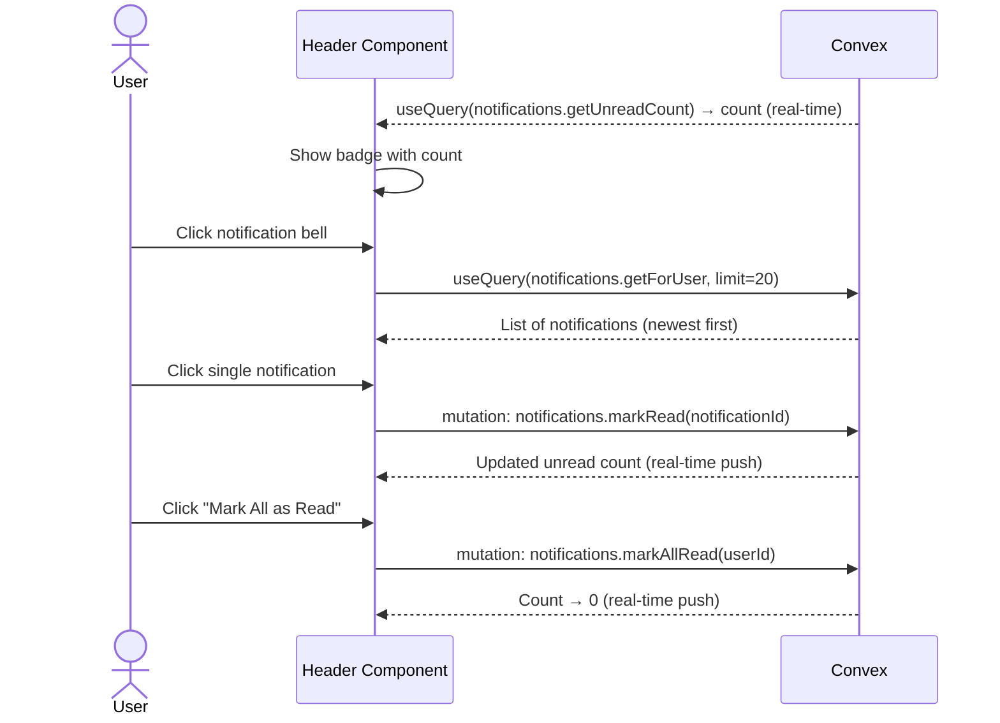

---

## 10. License & Multi-Hospital Architecture

### 10.1 Hospital & License Structure

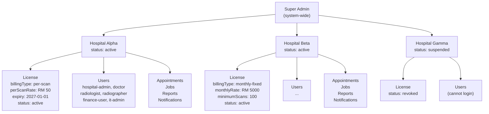

### 10.2 License Check at Login

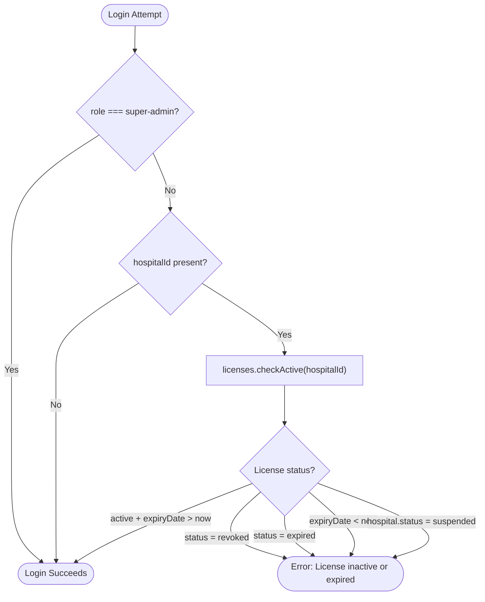

### 10.3 Billing Models

| Model | Field | Behaviour |
|-------|-------|-----------|
| **Per-Scan** | `billingType: "per-scan"`, `perScanRate: number` | Invoice generated per completed MRI scan at the per-scan rate |
| **Monthly-Fixed** | `billingType: "monthly-fixed"`, `monthlyRate: number`, `minimumScans?: number` | Flat monthly fee regardless of scan volume; `minimumScans` is a contractual minimum |

### 10.4 License Key Format

```
PXLC-{hospitalId}-{year}-{randomSuffix}

Example: PXLC-k17d82hx9q3-2026-7f3a
```

A new `generate()` call automatically revokes any existing active license for that hospital before creating the new one.

### 10.5 Data Isolation

All clinical tables carry a `hospitalId` field. Every Convex query that returns clinical data accepts an optional `hospitalId` parameter:

```
appointments.list(hospitalId?)     — filters by hospitalId
jobs.getRecentJobs(limit?, hospitalId?)
reports.getAllReports(hospitalId?)
notifications.getForUser(userId)   — inherently user-scoped
```

The `super-admin` role calls these queries without `hospitalId` to get system-wide results. All other roles pass their own `hospitalId`.

---

## 11. Frontend Route Map

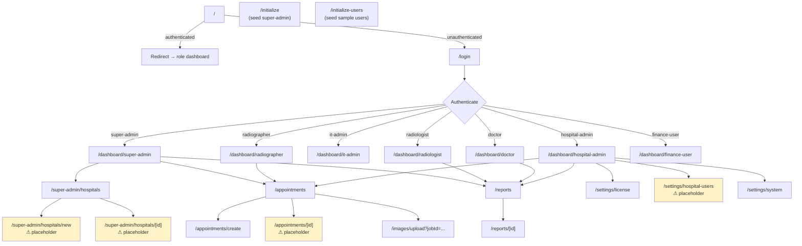

> **Legend:** Nodes marked ⚠ placeholder are routes that exist but render stub/empty content pending implementation.

---

## 12. Convex API Reference

### 12.1 `auth.ts`

| Function | Type | Args | Returns | Description |
|----------|------|------|---------|-------------|
| `login` | action | `{ email, password }` | User object | Authenticates user; checks bcrypt hash, active status, and license |
| `initializeDefaultAdmin` | action | — | `{ success, message }` | Creates super-admin `admin@pixelenceai.com` / `Click123*` (idempotent) |
| `initializeSampleUsers` | action | — | `{ success, created[] }` | Seeds 5 sample staff users (idempotent) |

### 12.2 `users.ts`

| Function | Type | Args | Returns | Description |
|----------|------|------|---------|-------------|
| `getByEmail` | query | `{ email }` | User (with hash) or null | Used internally by auth.login |
| `getById` | query | `{ userId }` | User (no hash) or null | Safe public fetch by ID |
| `listByHospital` | query | `{ hospitalId }` | User[] (no hashes) | All staff for a hospital |
| `listAll` | query | — | User[] (no hashes) | Super-admin: all users |
| `createInternal` | mutation | `{ email, passwordHash, firstName, lastName, role, hospitalId?, ... }` | userId | Low-level insert (hash pre-computed) |
| `create` | action | `{ email, password, firstName, lastName, role, hospitalId, ... }` | userId | Hashes password, calls createInternal, triggers welcome email |
| `update` | mutation | `{ userId, firstName?, lastName?, phone?, department?, isActive? }` | void | Patch user fields |
| `deactivate` | mutation | `{ userId }` | void | Sets `isActive: false` — blocks login |

### 12.3 `hospitals.ts`

| Function | Type | Args | Returns | Description |
|----------|------|------|---------|-------------|
| `create` | mutation | `{ name, address, contactEmail, contactPhone }` | hospitalId | Creates hospital with status "active" |
| `list` | query | — | Hospital[] | All hospitals ordered newest first |
| `getById` | query | `{ hospitalId }` | Hospital or null | Single hospital by ID |
| `update` | mutation | `{ hospitalId, name?, address?, contactEmail?, contactPhone? }` | void | Patch hospital fields |
| `suspend` | mutation | `{ hospitalId }` | void | status → "suspended" |
| `activate` | mutation | `{ hospitalId }` | void | status → "active" |
| `getStats` | query | — | `{ total, active, suspended }` | Aggregate counts |

### 12.4 `licenses.ts`

| Function | Type | Args | Returns | Description |
|----------|------|------|---------|-------------|
| `generate` | mutation | `{ hospitalId, billingType, perScanRate?, monthlyRate?, minimumScans?, startDate, expiryDate }` | licenseId | Creates new license; revokes existing active license |
| `getByHospital` | query | `{ hospitalId }` | License or null | Latest license for hospital |
| `getAllByHospital` | query | `{ hospitalId }` | License[] | Full license history |
| `checkActive` | query | `{ hospitalId }` | boolean | True if license status=active AND expiryDate > now |
| `expireStale` | mutation | — | void | Marks overdue licenses as "expired" |
| `revoke` | mutation | `{ licenseId }` | void | Sets status → "revoked" |
| `renew` | mutation | `{ licenseId, expiryDate, billingType?, ... }` | void | Updates expiry and billing terms |
| `getExpiringLicenses` | query | `{ daysAhead }` | License[] | Licenses expiring within N days |

### 12.5 `appointments.ts`

| Function | Type | Args | Returns | Description |
|----------|------|------|---------|-------------|
| `create` | mutation | `{ patientName, age, gender, complaint, referringPhysician, scheduledDateTime, hospitalId, radiographerId?, radiologistId?, doctorId?, ... }` | appointmentId | Creates appointment + auto-creates Job (status=Scheduled, priority=Normal) |
| `list` | query | `{ hospitalId? }` | Appointment[] | All appointments, optionally filtered |
| `getAllAppointments` | query | — | Appointment[] | System-wide (super-admin) |
| `get` | query | `{ id }` | Appointment or null | Single appointment |
| `updateStatus` | mutation | `{ appointmentId, status }` | void | Update status string |

### 12.6 `jobs.ts`

| Function | Type | Args | Returns | Description |
|----------|------|------|---------|-------------|
| `getRecentJobs` | query | `{ limit?, hospitalId? }` | Job[] | Recent jobs for dashboard |
| `getJobById` | query | `{ jobId }` | Job or null | Single job |
| `getByAppointment` | query | `{ appointmentId }` | Job or null | Job linked to appointment |
| `getByRadiologist` | query | `{ radiologistId }` | Job[] | Jobs assigned to radiologist |
| `completeUpload` | mutation | `{ jobId, dicomFiles[], imageCount, studyType? }` | void | Sets status→DICOM Uploaded; updates appointment; creates notification; calls gateway |
| `saveEnhancedMri` | mutation | `{ jobId, enhancedMriPath }` | void | Persists ML-generated image path |
| `updateStatus` | mutation | `{ jobId, status }` | void | Manual status update |

### 12.7 `reports.ts`

| Function | Type | Args | Returns | Description |
|----------|------|------|---------|-------------|
| `create` | mutation | `{ jobId, appointmentId, hospitalId, aiAnalysis? }` | reportId | Creates report with status "Analysis Complete" |
| `getAllReports` | query | `{ hospitalId? }` | Report[] | All reports for hospital |
| `get` | query | `{ id }` | Report or null | Single report by string ID |
| `getByJob` | query | `{ jobId }` | Report or null | Report linked to job |
| `getByDoctor` | query | `{ doctorId }` | Report[] | Reports for a specific doctor |
| `submitReport` | mutation | `{ reportId, radiologistId, radiologistComments, approved }` | void | Approves/submits report; updates job/appointment to Completed; creates notifications; calls gateway |
| `addDoctorComment` | mutation | `{ reportId, doctorId, doctorComments }` | void | Saves doctor's clinical notes |

### 12.8 `notifications.ts`

| Function | Type | Args | Returns | Description |
|----------|------|------|---------|-------------|
| `create` | mutation | `{ userId, type, title, message, referenceId?, referenceType? }` | notificationId | Creates in-app notification |
| `getForUser` | query | `{ userId, limit? }` | Notification[] | Notifications for user (newest first) |
| `getUnreadCount` | query | `{ userId }` | number | Count of unread notifications |
| `markRead` | mutation | `{ notificationId }` | void | Marks single notification as read |
| `markAllRead` | mutation | `{ userId }` | void | Marks all notifications read for user |

---

## 13. Express Gateway API Reference

**Base URL:** `http://localhost:3001` (configurable via `PORT` env var)

**Security:**
- Helmet HTTP headers on all responses
- CORS restricted to `CORS_ORIGINS` env var (default: `localhost:3000`)
- Rate limit: 100 requests per 15 minutes per IP on `/api/*`

### 13.1 Health

| Method | Path | Description |
|--------|------|-------------|
| `GET` | `/` | Service info JSON |
| `GET` | `/health` | Health check (no auth required) |

### 13.2 `/api/notifications`

#### `POST /api/notifications/scan-ready`

Sends email to radiologist when a DICOM scan is uploaded.

**Request body:**

```json
{
  "radiologistEmail": "radiologist@hospital.com",
  "radiologistName": "Dr. Michael Chen",
  "patientName": "Ahmad bin Abdullah",
  "jobId": "k17d82hx9q3..."
}
```

**Response:**

```json
{ "success": true }
```

---

#### `POST /api/notifications/report-submitted`

Sends email to doctor and hospital admin(s) when a report is submitted.

**Request body:**

```json
{
  "doctorEmail": "doctor@hospital.com",
  "doctorName": "Dr. Sarah Johnson",
  "adminEmails": ["admin@hospital.com"],
  "patientName": "Ahmad bin Abdullah",
  "reportId": "r93js2k...",
  "approved": true
}
```

**Response:**

```json
{ "success": true, "notified": 2 }
```

---

#### `POST /api/notifications/license-expiring`

Sends license expiry warning to super-admin and hospital admin.

**Request body:**

```json
{
  "emails": ["admin@pixelenceai.com", "admin@hospital.com"],
  "hospitalName": "Hospital Alpha",
  "expiryDate": "2026-04-01",
  "daysLeft": 14
}
```

**Response:**

```json
{ "success": true, "notified": 2 }
```

---

#### `POST /api/notifications/user-created`

Sends welcome email with login credentials to a newly created user.

**Request body:**

```json
{
  "email": "newuser@hospital.com",
  "firstName": "Jane",
  "lastName": "Doe",
  "role": "radiologist",
  "password": "TempPass123!",
  "hospitalName": "Hospital Alpha"
}
```

**Response:**

```json
{ "success": true }
```

---

### 13.3 `/api/auth`

Internal auth routes (JWT-based session management for file upload operations).

### 13.4 `/api/dicom`

DICOM file upload handling. Accepts multipart/form-data with files up to 100 MB. Temporary files stored in `backend-gateway/temp/`.

### 13.5 `/api/jobs`

Job management routes — bridge between frontend and backend processing pipeline.

---

## 14. Environment Configuration

### 14.1 Next.js Web App

| Variable | Required | Default | Description |
|----------|----------|---------|-------------|
| `NEXT_PUBLIC_CONVEX_URL` | ✅ | — | Convex deployment URL |

### 14.2 Express API Gateway (`backend-gateway/.env`)

| Variable | Required | Default | Description |
|----------|----------|---------|-------------|
| `PORT` | — | `3001` | Gateway listening port |
| `SMTP_HOST` | ✅ (email) | — | SMTP server hostname |
| `SMTP_PORT` | — | `587` | SMTP port (465 for SSL) |
| `SMTP_USER` | ✅ (email) | — | SMTP authentication username |
| `SMTP_PASS` | ✅ (email) | — | SMTP authentication password |
| `EMAIL_FROM` | — | `noreply@pixelenceai.com` | Sender address in outgoing emails |
| `APP_URL` | — | `http://localhost:3000` | Frontend URL used in email links |
| `ML_SERVICE_URL` | — | `http://localhost:8000` | FastAPI ML service base URL |
| `REDIS_URL` | — | `redis://localhost:6379` | Redis connection string |
| `JWT_SECRET` | ✅ (prod) | `your-jwt-secret-key` | JWT signing secret |
| `UPLOAD_DIR` | — | `../uploads` | DICOM file upload destination |
| `MAX_FILE_SIZE` | — | `104857600` (100 MB) | Maximum upload file size in bytes |
| `CORS_ORIGINS` | — | `http://localhost:3000` | Comma-separated allowed origins |

> **Note:** If `SMTP_HOST`, `SMTP_USER`, or `SMTP_PASS` are not set, the gateway enters **dry-run mode** — emails are logged to console but not sent. This is the safe default for local development.

### 14.3 Convex

| Variable | Set Via | Description |
|----------|---------|-------------|
| Convex project config | `npx convex dev` | Auto-configured from `.env.local` |
| Gateway URL (in actions) | Hardcoded `http://localhost:3001` | Should be moved to Convex env var for production |

---

## 15. Deployment Architecture

### 15.1 Development Topology

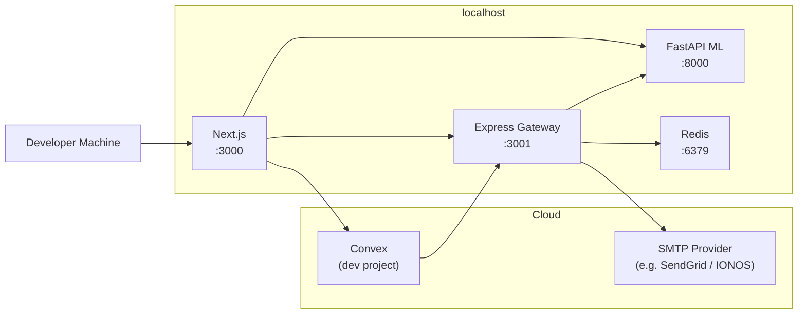

### 15.2 Recommended Production Topology

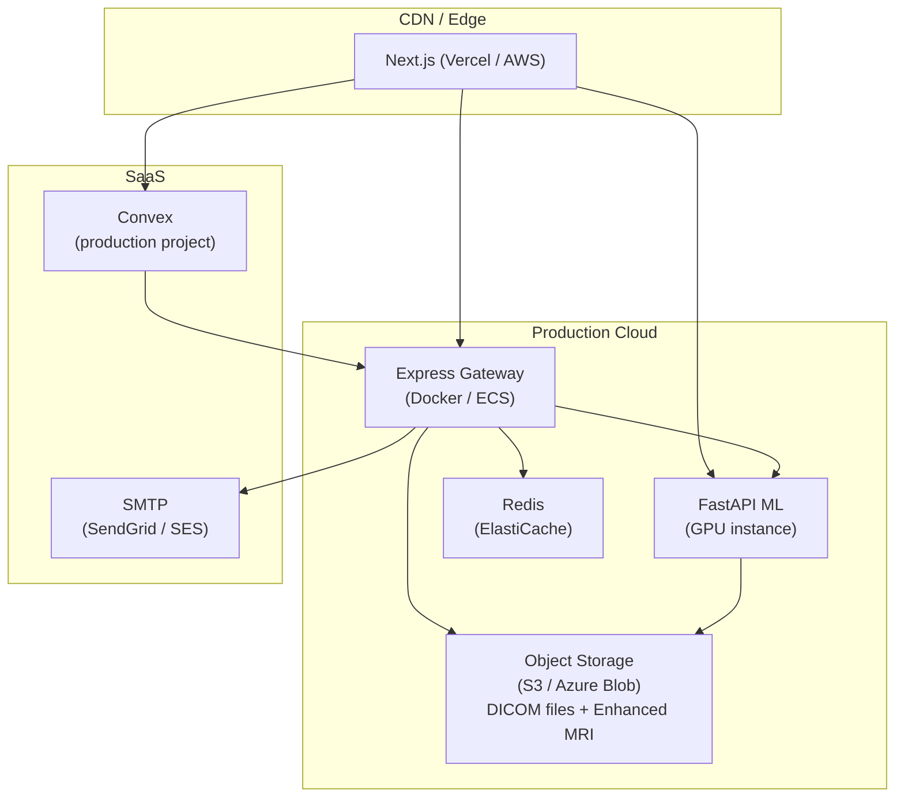

### 15.3 Monorepo Package Structure

```
PixelenceWebDesignRepo/
├── convex/                      — Convex function source (schema, auth, users, ...)
│   ├── schema.ts
│   ├── auth.ts
│   ├── users.ts
│   ├── hospitals.ts
│   ├── licenses.ts
│   ├── appointments.ts
│   ├── jobs.ts
│   ├── reports.ts
│   ├── notifications.ts
│   └── _generated/              — Auto-generated by npx convex dev (do not edit)
│
├── convex-client/               — Shared Convex client wrapper
│   └── src/index.ts             — anyApi-based untyped client
│
├── pixelence-mri-system/        — Next.js web application
│   ├── pages/                   — All routes
│   ├── components/              — Shared UI components
│   ├── contexts/                — React context providers
│   ├── styles/                  — Global CSS / Tailwind config
│   └── backend-gateway/         — Express API gateway
│       ├── src/
│       │   ├── server.js
│       │   ├── routes/
│       │   ├── middleware/
│       │   └── services/
│       └── package.json
│
├── pixelence-mobile/            — Expo React Native app
│   └── screens/
│
├── docs/                        — Project documentation
│   ├── UAT-Test-Plan.md
│   └── System-Functional-Documentation.md
│
├── turbo.json                   — Turborepo pipeline config
└── package.json                 — Root workspace config
```

---

*Document End — Pixelence MRI System Functional Documentation v1.0*
